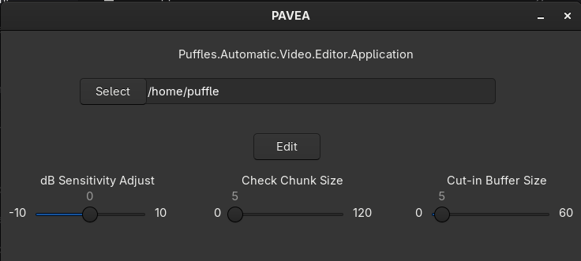

# Puffles Automatic Video Editor App

Very simple video editor made to cut streams down to the most impactful scenes. It's done by getting an average dB of the stream and then cutting out clips that fall under that dB. 

# Installation

Ensure wxWidgets, and ffmpeg are both installed.

Then just use the install.sh script. 

# Options
dB Sensitivity Adjust
    -Adjusts the the loudness the clip needs to be to be included
    -Higher dB means only louder clips included
    
Check Chunk Size
    -The size of the clips that will be included. In seconds
    
Cut-in Buffer Size
    -The buffer is extra seconds before that included clip that lets viewers see whats happening before those impactful clips
    
    

